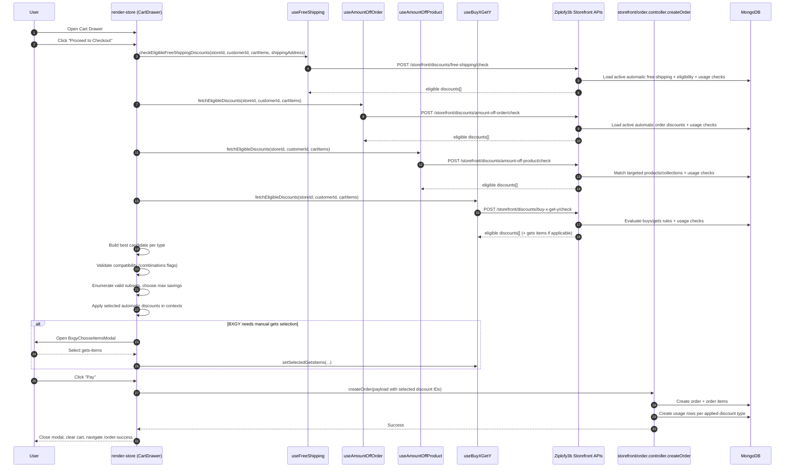

# Discount Flow Appendix: Sequence Diagram, DB Queries, Consistency Audit, and Break Risks

Generated on: 2026-02-18  
Workspace: `C:\Work\merged-ziplofy-`

This appendix complements `DISCOUNT_LOGIC_REPORT.md` with:
1. Sequence diagrams (cart checkout + product quick checkout)
2. MongoDB query cheatsheet for exact usage counts
3. Consistency audit (cart checkout vs quick checkout)
4. Missing pieces / break-risk checklist with priority

---

## 1) Sequence Diagrams

## 1.1 Cart Checkout Discount Flow (Current)



### Code anchors (cart flow)
- Discount fetch + auto-apply: `render-store/src/components/CartDrawer.tsx`
- Compatibility engine: `areDiscountsCompatible` in `CartDrawer.tsx`
- Place order payload with discount IDs: `handlePlaceOrder` in `CartDrawer.tsx`
- Usage row creation: `Ziplofy3b/src/controllers/storefront/order.controller.ts`

---

## 1.2 Product Buy-Now Quick Checkout Flow (Current)

```mermaid
sequenceDiagram
    autonumber
    participant U as User
    participant PDP as StorefrontProductDetailPage
    participant OFF as useProductOffers
    participant API as product-offers + order APIs
    participant ORD as storefront/order.controller.createOrder
    participant DB as MongoDB

    U->>PDP: Open product page
    PDP->>OFF: fetch*OffersForProduct(productId, customerId)
    OFF->>API: GET /product-offers/*/product/:id
    API->>DB: Resolve active offers for this product/customer
    API-->>OFF: offer lists per type

    U->>PDP: Click "Buy Now"
    PDP->>PDP: Open quick checkout modal with buyNowItem
    PDP->>PDP: Choose best product + order discounts
    PDP->>PDP: Apply compatibility checks
    PDP->>PDP: Optionally include free shipping

    U->>PDP: Confirm place order
    PDP->>ORD: createOrder(payload with selected discount IDs)
    ORD->>DB: Create order + order items + usage rows
    ORD-->>PDP: Success
    PDP-->>U: Navigate /order-success
```

---

## 2) MongoDB Query Cheatsheet (Exact Usage Counts)

Use in `mongosh` against your production/dev DB.

> Replace placeholders:
> - `<discountId>`: discount ObjectId
> - `<customerId>`: customer ObjectId
> - `<storeId>`: store ObjectId
> - `<YYYY-MM-DD>` date strings as needed

### 2.1 Collections map

- Amount off order usage: `amountofforderdiscountusages`
- Amount off products usage: `amountoffproductsdiscountusages`
- Free shipping usage: `freeshippingdiscountusages`
- Buy X Get Y usage: `buyxgetydiscountusages`

Note: verify exact collection names with `show collections` (depends on Mongoose pluralization/config).

### 2.2 Total uses for a specific discount

```javascript
db.amountofforderdiscountusages.countDocuments({ discountId: ObjectId("<discountId>") })
db.amountoffproductsdiscountusages.countDocuments({ discountId: ObjectId("<discountId>") })
db.freeshippingdiscountusages.countDocuments({ discountId: ObjectId("<discountId>") })
db.buyxgetydiscountusages.countDocuments({ discountId: ObjectId("<discountId>") })
```

### 2.3 Per-customer usage count for a discount

```javascript
db.amountofforderdiscountusages.countDocuments({
  discountId: ObjectId("<discountId>"),
  customerId: ObjectId("<customerId>")
})
```

Repeat same pattern for the other 3 usage collections.

### 2.4 Top-used discounts (per type)

```javascript
db.amountofforderdiscountusages.aggregate([
  { $group: { _id: "$discountId", totalUses: { $sum: 1 } } },
  { $sort: { totalUses: -1 } },
  { $limit: 20 }
])
```

Equivalent for each usage collection.

### 2.5 Top-used discounts across all 4 types (combined leaderboard)

```javascript
db.amountofforderdiscountusages.aggregate([
  { $project: { discountId: 1, type: { $literal: "amount-off-order" } } },
  { $unionWith: {
      coll: "amountoffproductsdiscountusages",
      pipeline: [{ $project: { discountId: 1, type: { $literal: "amount-off-product" } } }]
    }
  },
  { $unionWith: {
      coll: "freeshippingdiscountusages",
      pipeline: [{ $project: { discountId: 1, type: { $literal: "free-shipping" } } }]
    }
  },
  { $unionWith: {
      coll: "buyxgetydiscountusages",
      pipeline: [{ $project: { discountId: 1, type: { $literal: "buy-x-get-y" } } }]
    }
  },
  { $group: { _id: { discountId: "$discountId", type: "$type" }, totalUses: { $sum: 1 } } },
  { $sort: { totalUses: -1 } },
  { $limit: 30 }
])
```

### 2.6 Uses per day (trend chart source)

```javascript
db.freeshippingdiscountusages.aggregate([
  {
    $group: {
      _id: {
        day: { $dateToString: { format: "%Y-%m-%d", date: "$usedAt" } },
        discountId: "$discountId"
      },
      uses: { $sum: 1 }
    }
  },
  { $sort: { "_id.day": 1 } }
])
```

### 2.7 Usage in date range

```javascript
db.buyxgetydiscountusages.countDocuments({
  usedAt: {
    $gte: ISODate("2026-02-01T00:00:00.000Z"),
    $lt: ISODate("2026-03-01T00:00:00.000Z")
  }
})
```

### 2.8 Detect “one-use-per-customer” violations (sanity check)

```javascript
db.amountofforderdiscountusages.aggregate([
  {
    $group: {
      _id: { discountId: "$discountId", customerId: "$customerId" },
      uses: { $sum: 1 }
    }
  },
  { $match: { uses: { $gt: 1 } } },
  { $sort: { uses: -1 } }
])
```

Run same for each discount usage collection.

### 2.9 Join usage count with discount title/code (admin reporting)

```javascript
db.amountofforderdiscountusages.aggregate([
  { $group: { _id: "$discountId", totalUses: { $sum: 1 } } },
  {
    $lookup: {
      from: "amountofforderdiscounts",
      localField: "_id",
      foreignField: "_id",
      as: "discount"
    }
  },
  { $unwind: "$discount" },
  {
    $project: {
      _id: 0,
      discountId: "$_id",
      title: "$discount.title",
      discountCode: "$discount.discountCode",
      status: "$discount.status",
      totalUses: 1
    }
  },
  { $sort: { totalUses: -1 } }
])
```

---

## 3) Consistency Audit: Cart Checkout vs Product Quick Checkout

This is the most important section for flow reliability.

## 3.1 What is consistent

- Both flows eventually call `createOrder` and pass discount IDs.
- Both flows rely on backend usage collections being recorded in `storefront/order.controller.ts`.
- Both flows use combinations metadata (`combinations`) to decide compatibility.
- Both flows support automatic discounts.

## 3.2 Material differences (current behavior drift)

### A) Optimization strategy differs
- **CartDrawer**: builds one candidate/type, explores valid subsets, chooses max total savings.
- **Product quick checkout**: simpler pairwise logic (best product vs best order, then shipping compatibility).

Impact:
- Same customer/cart composition can get different discount outcomes depending on entry point.

### B) Shipping treatment differs
- **CartDrawer**: includes `shippingCost` (hardcoded ₹200 / 20000 minor units) and allows free shipping to reduce it.
- **Quick checkout**: final total shown as `subtotal - productDiscount - orderDiscount`; shipping is not modeled the same way in total arithmetic.

Impact:
- Final payable amount can diverge between cart and buy-now paths.

### C) Data source differs
- **CartDrawer**: `/storefront/discounts/*/check` with full cart payload.
- **Quick checkout**: `/product-offers/*/product/:id` lists, then local apply logic.

Impact:
- Product-offers endpoint constraints can omit cases that cart check catches (especially for complex BXGY targeting).

### D) BXGY complexity differs
- **CartDrawer** handles BXGY gets-item selection modal and can add gets-items into order items.
- **Quick checkout** is centered on single-item buy-now and does not run the same comprehensive selection workflow.

Impact:
- Edge BXGY campaigns may behave differently between flows.

---

## 4) Missing Pieces / Break-Risk Map (Prioritized)

## P0 (highest risk, can cause financial or hard-to-debug issues)

1. **No server-side canonical recomputation of discount totals at order creation**
   - `createOrder` accepts subtotal/shipping/tax/total from client payload.
   - Usage rows are guarded by basic checks, but final pricing trust boundary is mostly client side.
   - Risk: manipulated clients or flow drift create inconsistent charged totals.

2. **Usage limit race condition**
   - Pattern is check (`countDocuments`/`findOne`) then create usage row.
   - Concurrent orders can slip past limits before writes complete.
   - Risk: oversubscription beyond `totalUsesLimit`.

## P1 (high risk, causes mismatch/confusion)

3. **Cart vs quick-checkout discount engine mismatch**
   - Different optimization algorithms and shipping math.
   - Risk: user sees one price in buy-now and another in cart.

4. **Hardcoded shipping cost in cart flow**
   - `shippingCost = 20000` in `CartDrawer`.
   - Risk: incorrect totals if shipping profiles/zones change.

5. **Product-offers vs storefront-check divergence**
   - Product-offers endpoints are for “offer surfacing”, not guaranteed full checkout-equivalent resolution.
   - Risk: shown offer may not match final checkout eligibility in all cases.

## P2 (medium risk, stability/operability)

6. **Admin form/backend unit ambiguity (fixed amount paths)**
   - Potential conversion mismatch for fixed amount in amount-off-order flow.
   - Risk: wrong stored discount value.

7. **Inconsistent strictness for requiring `customerId` across endpoints**
   - Some flows permit nullable customer, others require.
   - Risk: guest behavior differs by discount type.

8. **Combination flags rely heavily on client enforcement**
   - If another client app is added, it may apply discounts differently unless server centralizes policy.

---

## 5) What Is Missing Right Now (Direct Answer)

Short answer: **yes**, there are missing pieces that can break or drift the flow.

Missing items:
- A **single backend canonical “pricing + discount resolver”** used at final order creation.
- **Transactional usage-limit enforcement** (or atomic counters/locks).
- Unified discount calculator shared by both cart checkout and quick checkout.
- Shipping price source from actual shipping profile/zone logic (not hardcoded in UI).
- End-to-end parity tests that compare cart vs buy-now totals for same scenario matrix.

If these are not added, the system still works, but reliability degrades as campaigns become more complex.

---

## 6) Recommended Stabilization Plan (Concrete)

1. Build server endpoint: `POST /storefront/checkout/quote`
   - Input: cart items, address, customer
   - Output: canonical applied discounts + totals + reasons
   - Use this in both cart modal and quick checkout.

2. On `createOrder`, recompute and verify totals server-side before persisting.

3. Wrap usage checks + writes in transaction (or enforce via unique/index + retry strategy).

4. Replace hardcoded shipping with computed shipping quote.

5. Add regression matrix tests:
   - each discount type alone
   - each pair with combo true/false
   - all four combinations
   - limit and one-use-per-customer edge cases
   - cart vs buy-now parity assertion

---

## 7) Quick Checklist for Manual QA (Large Flow Simplifier)

- [ ] Same SKU, same qty, same user -> cart total equals quick-checkout total
- [ ] Toggle each combinations flag and verify compatibility outcomes
- [ ] One-use-per-customer blocks second order
- [ ] Total use limit blocks once max reached
- [ ] Free shipping applies/removes based on address country rules
- [ ] BXGY gets-items required path works and persists correct order items
- [ ] Switching addresses re-evaluates shipping and eligibility
- [ ] Guest vs logged-in behavior is intentional per type

